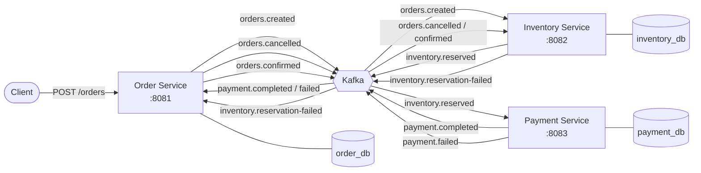
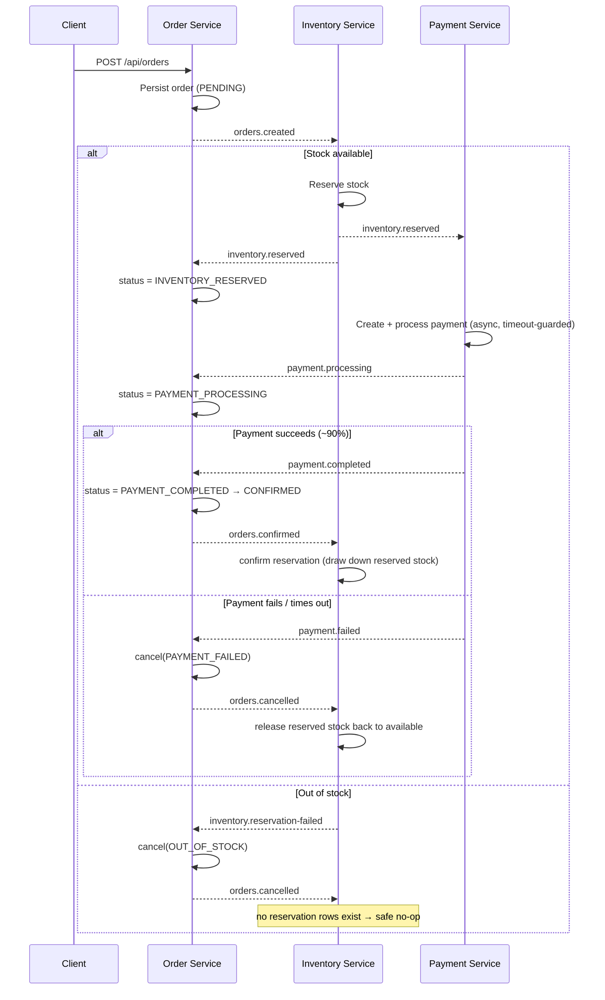

# Order Management System

An **event-driven microservices platform** for processing e-commerce orders, built around a **Kafka choreography saga**. 
Three independent services coordinate a distributed transaction — order creation, inventory reservation, and payment — communicating exclusively through domain events, with no synchronous service-to-service calls.

Built with Java 17, Spring Boot 3.2.5, Apache Kafka, and PostgreSQL.

---

## Table of Contents

- [Why this project](#why-this-project)
- [Architecture](#architecture)
- [The Saga Flow](#the-saga-flow)
- [Tech Stack](#tech-stack)
- [Module Layout](#module-layout)
- [Kafka Topics](#kafka-topics)
- [State Machines](#state-machines)
- [Getting Started](#getting-started)
- [API Overview](#api-overview)
- [Architectural Decisions & Trade-offs](#architectural-decisions--trade-offs)
- [Known Limitations](#known-limitations)
- [Roadmap](#roadmap)
- [Testing](#testing)

---

## Why this project

This is a study in **distributed transaction management without a distributed transaction coordinator**.
Rather than two-phase commit or a synchronous orchestrator, services react to events
and own their slice of the workflow.
The interesting problems here are the ones that don't exist in a monolith: partial failure, eventual consistency, idempotency, compensating actions, and the dual-write problem.

The codebase deliberately favours patterns that scale to real teams — domain-driven layering, the command pattern at the service boundary, topic ownership by producer, and schema-validated migrations — over the shortest path to a working demo.

---

## Architecture

A **choreography-based saga**: there is no central orchestrator. 
Each service subscribes to the events that concern it, does its work, and emits the next event. The order's lifecycle emerges from the chain of reactions.



**Key property:** each service owns its own database. 
No service reads another service's tables. 
The only contract between services is the event schema in the shared `events` module.

---

## The Saga Flow



---

## Tech Stack

| Concern | Choice |
|---|---|
| Language | Java 17 |
| Framework | Spring Boot 3.2.5 (Web, Data JPA, Kafka) |
| Messaging | Apache Kafka (Confluent `cp-kafka:8.0.0`) |
| Persistence | PostgreSQL 16 (prod), H2 (tests) |
| Migrations | Flyway |
| Mapping | MapStruct (entity ↔ DTO) |
| Boilerplate | Lombok |
| Validation | Jakarta Bean Validation + Guava `Preconditions` |
| Build | Maven (multi-module) |
| Infra | Docker Compose (Kafka, PostgreSQL, Kafka UI, pgAdmin) |
| CI | GitHub Actions |

---

## Module Layout

```
order-management/
├── events/              Shared, immutable event records (the inter-service contract)
├── common/              Shared error-handling primitives (RFC 7807 problem details)
├── order-service/       :8081  →  order_db    Order lifecycle & saga entry point
├── inventory-service/   :8082  →  inventory_db Stock reservation
└── payment-service/     :8083  →  payment_db   Payment processing
```

Each service follows the same DDD-oriented layering:

```
domain/        Entities with business logic + state-machine enums
repository/    Spring Data JPA interfaces
service/       Business orchestration (accepts domain commands)
controller/    REST endpoints (translate DTO → command)
dto/           Request/response transport objects
mapper/        MapStruct mappings
messaging/     Kafka producers & consumers
config/        Kafka, executor, and topic configuration
exception/     Service-specific handlers
```

---

## Kafka Topics

**Topic ownership = producer ownership.** A service declares a `NewTopic` bean only for topics it *publishes*. This keeps the schema authority unambiguous.

| Topic | Owner / Producer | Consumers |
|---|---|---|
| `orders.created` | order-service | inventory-service |
| `orders.cancelled` | order-service | inventory-service |
| `orders.confirmed` | order-service | inventory-service |
| `inventory.reserved` | inventory-service | payment-service, order-service |
| `inventory.reservation-failed` | inventory-service | order-service |
| `payment.processing` | payment-service | order-service |
| `payment.completed` | payment-service | order-service |
| `payment.failed` | payment-service | order-service |

All consumers use **manual acknowledgment** (`AckMode.MANUAL_IMMEDIATE`). An unacknowledged message is redelivered, which is the retry mechanism for transient failures.

---

## State Machines

State transitions are validated on the domain entities themselves (`canTransitionTo()`), not in the service layer — invalid transitions are rejected at the source.

**Order:**
```
PENDING → INVENTORY_RESERVED → PAYMENT_PROCESSING → PAYMENT_COMPLETED → CONFIRMED → SHIPPED → DELIVERED
```
Any non-terminal state can transition to `CANCELLED` (with a tracked `CancellationReason`).

**Payment:**
```
PENDING → PROCESSING → COMPLETED → REFUNDED (the refund is not included here since that would be a different workflow)
PENDING / PROCESSING → FAILED
```

---

## Getting Started

### Prerequisites

- Java 17
- Maven 3.9+
- Docker & Docker Compose

### 1. Start infrastructure

```bash
cd order-service/docker
docker compose up -d
```

This brings up Kafka (`:9092`), PostgreSQL (`:5433`), Kafka UI (`:8080`), and pgAdmin (`:5050`). Databases `order_db`, `inventory_db`, and `payment_db` are created automatically.

> **Note:** PostgreSQL is mapped to host port **5433**, not 5432, to avoid clashing with a local Postgres install.

### 2. Build

```bash
mvn clean package
```

### 3. Run the services

```bash
SPRING_PROFILES_ACTIVE=postgres mvn spring-boot:run -pl order-service
SPRING_PROFILES_ACTIVE=postgres mvn spring-boot:run -pl inventory-service
SPRING_PROFILES_ACTIVE=postgres mvn spring-boot:run -pl payment-service
```

### 4. Watch it work

- **Kafka UI** → http://localhost:8080 — inspect topics and message flow
- **pgAdmin** → http://localhost:5050 — connect to `postgres:5432` on the Docker network (port 5433 from host)

---

## API Overview

Representative endpoints (see controllers for the full set):

**Order Service** (`:8081`)
```
POST   /api/orders                Create an order (saga entry point)
GET    /api/orders/{id}           Fetch an order
GET    /api/orders                List all orders
GET    /api/orders/customer/{id}  Orders for a customer
```

**Inventory Service** (`:8082`)
```
POST   /api/products              Register a product with stock
GET    /api/products/{id}         Fetch a product
```

**Payment Service** (`:8083`)
```
POST   /api/payments              Direct payment (also driven by saga)
GET    /api/payments/{id}         Fetch a payment
```

Errors are returned via a shared exception-handling base.

---

## Architectural Decisions & Trade-offs

The decisions below were made deliberately; each carries a cost that was weighed.

### 1. Choreography saga over orchestration
**Decision:** services react to events rather than being driven by a central orchestrator.
**Trade-off:** maximal decoupling and no single point of coordination — but the workflow is *implicit*, spread across consumers. There is no one place to read the whole saga. As the flow grows, an orchestrated saga (e.g. a state-machine service) would become easier to reason about. For a 3-step flow, choreography is the right weight.

### 2. Command pattern at the service boundary (payment-service standard)
**Decision:** `payment-service` accepts domain commands (`CreatePaymentCommand`, `ProcessPaymentCommand`), never transport DTOs.
Controllers and Kafka consumers both translate their input into the same commands.

**Why:** payment is the one service with *two* entry points for the same operation — a REST `PaymentRequest` and an inbound `inventory.reserved` event. Taking transport DTOs directly would force a choice between duplicating the processing logic per adapter or letting one adapter fabricate the other's DTO, and it would leak HTTP/Kafka types into the domain. A command is a transport-neutral intent object: both adapters map to it, the service exposes a single signature regardless of caller, and the business logic stays independently testable without standing up a controller or a consumer.

**Trade-off:** one extra translation layer, but the service API is identical whether invoked by REST or by an event — adapters stay thin and the core stays transport-agnostic.
This is the current target pattern, adopted while building the most recent service; `order-service` and `inventory-service` predate it and still take DTOs directly. Retrofitting them is a roadmap item.

### 3. Services return entities; controllers map to DTOs (payment-service standard)
**Decision:** in `payment-service`, no DTOs appear in service method signatures, and repository finders return `Optional<T>` so the caller decides whether absence is an error (e.g. `findByOrderId` → `Optional<Payment>`).

**Trade-off:** keeps mapping concerns at the edge, but callers must consciously handle `Optional`. Chosen over services throwing `NotFound` so the same method serves both "must exist" and "may exist" call sites.
As with the command pattern, this convention currently lives in `payment-service` only — the earlier two services return DTOs from the service layer.

### 4. Topic ownership by producer
**Decision:** each service declares `NewTopic` beans only for topics it publishes. (The project originally had order-service own every topic — that was refactored out.)

**Trade-off:** clear schema authority and no central topic registry, at the cost of having to look across services to see the full topic map (documented above to compensate).

### 5. No `KafkaAdmin` bean — topics auto-create at runtime
**Decision:** topics are created from `NewTopic` beans on startup; no `KafkaAdmin`.

**Trade-off:** removing `KafkaAdmin` eliminated long build delays caused by connection-retry loops during `mvn package`. 
The cost is less explicit admin control over topic configuration — acceptable for this scope.

### 6. Timeout-guarded payment gateway via a managed `ExecutorService`
**Decision:** the (mock) payment gateway call runs on a Spring-managed `ExecutorService` (`destroyMethod = "shutdown"`), wrapped in `Future.get(timeout, unit)` with cancellation on timeout.
`ThreadLocalRandom` for the mock, and `InterruptedException` restores the interrupt flag.

**Trade-off:** more moving parts than a blocking call, but a hung gateway cannot stall the saga. Chosen over `@Async` (too implicit for this control) and `ScheduledExecutorService` (wrong tool).

### 7. State validation on the entity, not the service
**Decision:** `OrderStatus`/`PaymentStatus` enums own `canTransitionTo()`; entities reject invalid transitions.

**Trade-off:** business rules live in the domain where they belong and can't be bypassed, at the cost of fatter enums.

### 8. Unidirectional `@OneToMany` with a non-null join column
**Decision:** `Order.items` is a unidirectional `@OneToMany` + `@JoinColumn(name = "order_id", nullable = false)`; `OrderItem` has no back-reference.

**Trade-off:** cleaner DDD aggregate (no bidirectional back-pointer), but `nullable = false` is **mandatory** — without it Hibernate inserts items with a null FK and then updates, violating the NOT NULL constraint.

### 9. Snapshot product data on `OrderItem`
**Decision:** `OrderItem` stores a snapshot (`productSku`, `productName`, `price`) *plus* a `productId` reference.
**Trade-off:** data duplication, but orders become immutable historical records — a confirmed order shows what was actually bought at the price paid, 
even if the product later changes or is delisted. The reference is retained for enrichment/analytics.

### 10. `ddl-auto: validate` in all profiles
**Decision:** Hibernate never generates schema; Flyway owns it, and Hibernate only validates against it.

**Trade-off:** every schema change requires a migration (more ceremony), but entity/schema drift is caught at startup — it has already caught real column-name mismatches mid-project.

### 11. Reservation ledger as the source of truth for compensation
**Decision:** inventory-service records a `reservations` row (`RESERVED → RELEASED | CONFIRMED`) per order item rather than driving compensation off the reserved-quantity counter alone. Stock reservation is **all-or-nothing and two-phase**: every item is validated with no mutation, and only if all pass are reservations made and rows written — so rows exist solely for fully-reserved orders. Release and confirm act only on `RESERVED` rows.

**Why:** the `orders.cancelled` event already carries its items, so release *could* be driven straight off the event — but Kafka redelivery would then double-release stock. Reconciling against the ledger makes compensation **idempotent** (a redelivered event finds no `RESERVED` rows and is a safe no-op) and gives each order an auditable reservation history. The two-phase reserve avoids a partial-mutation leak where items reserved before a failing item would otherwise be stranded with no row to release.

**Trade-off:** an extra table and the bookkeeping to keep it in step with the product counters, in exchange for a compensation path that is correct under redelivery — the property that matters most in a choreography saga.

---

## Known Limitations

Stated honestly — these are the gaps an experienced reviewer would (rightly) ask about.

- **Dual-write between DB and Kafka.** Events are published after the local transaction commits, inside a try/catch. If the publish fails, the DB state and the event stream diverge. The fix is the **transactional outbox pattern** (on the roadmap).
- **No dead-letter queue.** A consistently failing message is retried indefinitely rather than parked. Poison messages need a DLQ + retry-with-backoff topology.
- **Uneven test coverage.** order- and inventory-service have unit and repository tests; payment-service — the most logic-heavy service — currently has none.
- **No distributed tracing.** There is no correlation ID propagated across the event chain, so following one order across three services means manually stitching logs.
- **No authentication/authorization** on the REST endpoints.

---

## Roadmap

**Near term — correctness & completeness**
- [x] **Compensating action** — inventory-service reconciles a per-order reservation ledger: it consumes `orders.cancelled` to release reserved stock back to available, and `orders.confirmed` to draw down reserved stock on fulfilment. Both are idempotent (only `RESERVED` rows are acted on), closing the saga's failure and success paths.
- [ ] **Payment-service test suite** — unit + integration coverage for timeout, idempotency, and the async gateway path.
- [ ] **Transactional outbox** — eliminate the dual-write problem; publish events from a DB-backed outbox via a relay/CDC.

**Mid term — production-readiness**
- [ ] **Dead-letter queues** with retry-and-backoff for poison messages.
- [ ] **Observability** — Spring Actuator + Micrometer metrics, and OpenTelemetry distributed tracing with a correlation ID threaded through every event.
- [ ] **OpenAPI/Swagger** documentation for all REST surfaces.
- [ ] **Per-service Dockerfiles + a root `docker compose up`** that boots the entire system in one command.

**Longer term — features**
- [ ] **Fraud detection** via Kafka Streams over payment events — windowed velocity checks and amount-pattern scoring that can veto a payment before processing.
- [ ] **Order fulfilment** stages (`SHIPPED`, `DELIVERED`) and a notification service.
- [ ] **Authentication & authorization** on public endpoints.

---

## Testing

```bash
mvn test                                              # All unit tests
mvn -pl order-service test                            # One module
mvn -pl order-service test -Dtest=OrderServiceTest    # One class
mvn failsafe:integration-test                         # Integration tests
```

- **Unit tests** cover entities, mappers, state transitions, and repository queries.
- **Integration tests** (`*IT` suffix) use `@Testcontainers` against real PostgreSQL.
Most are `@Disabled` by default so a Docker daemon isn't required for a plain `mvn test`.

---

## License

A demonstrator project that showcases an event-driven microservices architecture. 
Provided as-is, for reference and educational purposes.  
